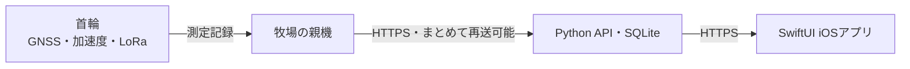

# システム構成（試作案）

## 各ディレクトリの役割

| 場所 | 内容 |
| --- | --- |
| `firmware/collar/` | 首輪に搭載するマイコンのコード。GNSS、加速度センサー、LoRa送信を扱う。 |
| `firmware/gateway/` | 親機のコード。LoRa受信、PC・サーバーとの通信を扱う。 |
| `apps/mobile/` | SwiftUIアプリ。優先一覧、最新位置、日別経路、活動量、欠測表示。 |
| `apps/api/` | SQLite保存、重複排除、優先判定、HTTPS接続を前提とした読み取りAPI。 |
| `hardware/electronics/` | 配線図、回路図、ピン割り当て、部品表。 |
| `hardware/enclosure/` | Fusionの設計データ、STL、印刷条件。 |
| `docs/test-results/` | 測位、通信距離、消費電力、装着試験の結果。 |

## 現在の状態

`apps/mobile/` と `apps/api/` にサンプルデータで動く試作を作成済みです。WindowsでPythonテストとSwiftの構文確認を行いました。Xcodeでのビルド、首輪→親機→APIの実データ接続、クラウド公開は未実施です。

## 共有するデータ形式

親機からAPIへ送る項目と重複排除の方法は[データ仕様案](data-contract.md)を参照してください。首輪と親機の間の形式はハード側との調整事項です。
