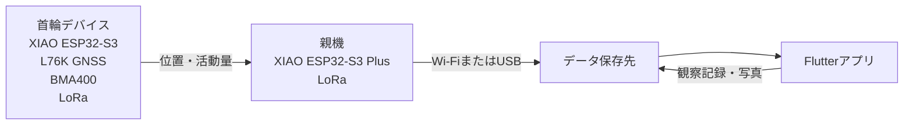

# システム構成



## 各ディレクトリの役割

| 場所 | 内容 |
| --- | --- |
| `firmware/collar/` | 首輪に搭載するマイコンのコード。GNSS、加速度センサー、LoRa送信を扱う。 |
| `firmware/gateway/` | 親機のコード。LoRa受信、PC・サーバーとの通信を扱う。 |
| `apps/mobile/` | Flutterアプリ。注意牛一覧、地図、個体記録、活動量グラフ、観察記録を実装する。 |
| `hardware/electronics/` | 配線図、回路図、ピン割り当て、部品表。 |
| `hardware/enclosure/` | Fusionの設計データ、STL、印刷条件。 |
| `docs/test-results/` | 測位、通信距離、消費電力、装着試験の結果。 |

## 実装順

1. `firmware/collar/` でGNSSとBMA400のデータを取得する。
2. `firmware/gateway/` を作り、LoRa受信データをPCで確認する。
3. 送受信するデータ形式を固定する。
4. `apps/mobile/` にFlutterアプリを作り、まずはダミーデータで画面を作る。
5. 親機の実データをアプリへ接続する。

## 共有するデータ形式

```json
{
  "deviceId": "cow-001",
  "timestamp": "2026-09-14T12:00:00+09:00",
  "latitude": 34.331521,
  "longitude": 133.168771,
  "altitudeM": 7.3,
  "satellites": 19,
  "hdop": 0.8,
  "activity": 0
}
```

通信量を抑える実機版では、JSONではなく同じ項目をバイナリ形式で送るかを検討します。
